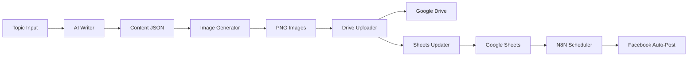

# 🚀 Content Automation System

> Hệ thống tự động hóa tạo nội dung đa thương hiệu với AI, tích hợp Google Sheets và Facebook Auto-posting

## 📋 Mục Lục

- [Tổng Quan](#tổng-quan)
- [Kiến Trúc Hệ Thống](#kiến-trúc-hệ-thống)
- [Brands Được Quản Lý](#brands-được-quản-lý)
- [Quy Trình Tự Động Hóa](#quy-trình-tự-động-hóa)
- [Cài Đặt](#cài-đặt)
- [Sử Dụng](#sử-dụng)
- [Dashboard](#dashboard)
- [API Reference](#api-reference)
- [Workflows](#workflows)
- [Troubleshooting](#troubleshooting)

---

## 🎯 Tổng Quan

Hệ thống Content Automation được xây dựng để tự động hóa hoàn toàn quy trình:
1. ✍️ **Tạo nội dung** bằng AI (Claude)
2. 🎨 **Thiết kế hình ảnh** carousel theo phong cách brand
3. ☁️ **Tải lên Google Drive** và cập nhật Google Sheets
4. 📱 **Tự động đăng lên Facebook** theo lịch

### Công Nghệ Sử Dụng

- **AI**: Anthropic Claude API (content generation)
- **Image Generation**: Puppeteer (headless Chrome)
- **Cloud Storage**: Google Drive API
- **Data Management**: Google Sheets API
- **Automation**: N8N workflows
- **Monitoring**: WebSocket + HTTP Dashboard
- **Database**: SQLite (analytics)

---

## 🏗️ Kiến Trúc Hệ Thống

```
┌─────────────────────────────────────────────────────────────┐
│                    Dashboard (Web UI)                       │
│              http://localhost:3002                          │
└───────────────────────┬─────────────────────────────────────┘
                        │
                        ▼
┌─────────────────────────────────────────────────────────────┐
│                   Workflow Monitor                          │
│                ws://localhost:3001                          │
└───────────────────────┬─────────────────────────────────────┘
                        │
                        ▼
┌─────────────────────────────────────────────────────────────┐
│                   Daily Agent (Orchestrator)                │
│                 scripts/daily-agent.js                      │
└─────┬───────────────┬───────────────┬───────────────┬───────┘
      │               │               │               │
      ▼               ▼               ▼               ▼
┌─────────┐   ┌─────────────┐   ┌──────────┐   ┌──────────┐
│ Writer  │   │  Generator  │   │ Uploader │   │  Sheets  │
│ (Claude)│   │ (Puppeteer) │   │ (Drive)  │   │ Updater  │
└─────────┘   └─────────────┘   └──────────┘   └──────────┘
                                       │               │
                                       ▼               ▼
                              ┌─────────────────────────────┐
                              │     Google Cloud APIs       │
                              │  - Drive                    │
                              │  - Sheets                   │
                              └──────────────┬──────────────┘
                                             │
                                             ▼
                              ┌─────────────────────────────┐
                              │     N8N Auto-Poster         │
                              │  → Facebook Graph API       │
                              └─────────────────────────────┘
```

---

## 🎨 Brands Được Quản Lý

### 1. **Long Best AI** 🤖
- **Mô tả**: Fanpage giáo dục AI bằng tiếng Việt
- **Brand ID**: `longbest-ai`
- **Design Styles**:
  - `notebook` (primary) - NotebookLM-inspired
  - `tutorial` - Step-by-step guides
  - `infographic` - Data visualization
- **Google Sheet**: [1RAHjxLDULl0aRWHSX0aqUh1dqv7li7zwi0DZA6atQj0](https://docs.google.com/spreadsheets/d/1RAHjxLDULl0aRWHSX0aqUh1dqv7li7zwi0DZA6atQj0)
- **Facebook Page**: 827345413796018
- **Content Pillars**: Tutorials, Tips & Tricks, Case Studies, Tool Reviews, News & Updates

### 2. **Queen Nail Bern** 💅
- **Mô tả**: Nail salon tại Bern, Switzerland
- **Brand ID**: `queennailbern`
- **Design Styles**:
  - `quote` (primary) - Elegant quotes
  - `infographic` - Tips and data
- **Google Sheet**: [1MPyLQw9Q4sLlRiSvWSCyY4NvtVGeoDKoib6n3f4PRTo](https://docs.google.com/spreadsheets/d/1MPyLQw9Q4sLlRiSvWSCyY4NvtVGeoDKoib6n3f4PRTo)
- **Facebook Page**: 633948429809789
- **Languages**: Tiếng Đức (primary), Tiếng Việt (secondary)
- **Content Pillars**: Nail Designs & Trends, Tips & Care, Promotions, Reviews, BTS

### 3. **Thach Vu Land** 🏘️
- **Mô tả**: Bất động sản Bình Dương
- **Brand ID**: `thachvuland`
- **Design Styles**:
  - `infographic` (primary) - Property data
  - `notebook` - Educational content
- **Google Sheet**: [1SNv1t0h-KRXWQ4xANroW5RQN6zHU57OrrXj_OqzfVsY](https://docs.google.com/spreadsheets/d/1SNv1t0h-KRXWQ4xANroW5RQN6zHU57OrrXj_OqzfVsY)
- **Contact**: 0903.469.888
- **Content Pillars**: Project Reviews, Market Insights, Investment Tips, Success Stories

---

## ⚙️ Quy Trình Tự Động Hóa

### 🔄 Workflow Hoàn Chỉnh



### 📝 Chi Tiết Từng Bước

#### Step 1: **Content Generation** (AI Writer)
```bash
node scripts/agent-writer/writer.js "Topic" --brand longbest-ai --format carousel-standard
```
- Đọc context từ `context-{brand}.md`
- Gọi Claude API để tạo nội dung
- Lưu kết quả vào file JSON

**Output**: `scripts/carousel-generator/content/{topic}.json`

#### Step 2: **Image Generation** (Carousel Generator)
```bash
node scripts/carousel-generator/generator.js content/{topic}.json --brand longbest-ai
```
- Đọc file JSON content
- Render từng slide bằng Puppeteer
- Áp dụng design style và brand colors

**Output**: `output/{date}_{topic}/01.png, 02.png, ...`

#### Step 3: **Upload to Drive**
```bash
node scripts/drive-uploader/upload.js output/{folder} --brand longbest-ai
```
- Tạo folder trên Google Drive
- Upload tất cả images
- Trả về Drive Folder ID và Link

**Output**: Drive Folder với images

#### Step 4: **Update Google Sheets**
```bash
# Tự động được gọi sau upload
```
- Thêm row mới vào tab "Post"
- Điền Drive_Folder_ID, Drive_Link, Caption, Status="Ready"
- Metadata: brand, topic, created_at

**Output**: Row mới trong Google Sheet

#### Step 5: **N8N Auto-Post**
```
Trigger: Every 30 minutes
```
- Query Google Sheet WHERE Status="Ready"
- Download images từ Drive
- Post lên Facebook với caption
- Update Status="Done", Post_URL

---

## 🛠️ Cài Đặt

### Prerequisites

```bash
# Node.js 18+
node --version

# NPM packages
npm install
```

### Google Cloud Setup

1. **Tạo Google Cloud Project**: https://console.cloud.google.com
2. **Enable APIs**:
   - Google Drive API
   - Google Sheets API
3. **Tạo credentials**:
   - Download `credentials.json` vào root folder
4. **Authenticate**:
```bash
npm run auth
```

### Anthropic API

1. Lấy API key tại: https://console.anthropic.com
2. Tạo file `.env`:
```env
ANTHROPIC_API_KEY=your_api_key_here
```

### N8N Setup

1. Import workflows từ `n8n-skill/`:
   - `autopost-tvland.json`
   - `upload-claude-content.json`
   - `nano-banana-pro.json`
   - `daily-sketchnote-researcher.json`

2. Cấu hình credentials trong N8N:
   - Google Drive
   - Google Sheets
   - Facebook Graph API

---

## 🚀 Sử Dụng

### 1. Khởi Động Dashboard

```bash
# Cách 1: Script tổng hợp (khuyến nghị)
./scripts/workflow-monitor/start-all.sh

# Cách 2: NPM script
npm run start:monitor

# Cách 3: Manual
node scripts/workflow-monitor/monitor.js &
node scripts/workflow-monitor/server.js &
```

Truy cập: **http://localhost:3002**

### 2. Tạo Nội Dung Qua Dashboard

1. Mở dashboard tại `http://localhost:3002`
2. Chọn **Fanpage** (longbest-ai, queennailbern, thachvuland)
3. Nhập **Topic** (ví dụ: "5 AI Tips cho 2026")
4. Chọn **Định Dạng**:
   - Auto (tự động)
   - Carousel Standard (5-7 slides)
   - Carousel Compact (3-4 slides)
   - Single Post (1 hình)
5. Chọn **Phong Cách** (tùy brand)
6. Click **"🚀 Tạo Ngay"**
7. Theo dõi workflow real-time trong Dashboard

### 3. Tạo Nội Dung Qua CLI

```bash
# Workflow đầy đủ
node scripts/daily-agent.js "Topic Name" --brand longbest-ai

# Chỉ tạo content
node scripts/agent-writer/writer.js "Topic" --brand longbest-ai --format carousel-standard

# Chỉ tạo images
node scripts/carousel-generator/generator.js content/topic.json --brand longbest-ai

# Chỉ upload
node scripts/drive-uploader/upload.js output/folder --brand longbest-ai
```

### 4. Lên Lịch Tự Động

```bash
# Crontab example (chạy mỗi ngày 8h sáng)
0 8 * * * cd /path/to/automation && node scripts/daily-agent.js "Daily Topic" --brand longbest-ai
```

---

## 📊 Dashboard

### Features

- ✅ **Tạo nội dung mới**: Form nhập topic, chọn brand và style
- ✅ **Monitor real-time**: Theo dõi workflows đang chạy
- ✅ **Metrics**: Tổng số, đang chạy, thành công, thất bại
- ✅ **Xem Google Sheets**: Link trực tiếp đến Sheet của brand
- ✅ **WebSocket**: Cập nhật trạng thái real-time

### Screenshots

**Scheduler Panel**:
- Chọn Fanpage
- Nhập Topic
- Chọn Format (Auto, Carousel Standard/Compact, Single Post)
- Chọn Design Style (tùy brand)

**Monitor Panel**:
- Metrics cards
- Active workflows list
- Step-by-step progress
- Success/Failure notifications

---

## 🔌 API Reference

### POST /api/create-content

Tạo content workflow mới.

**Endpoint**: `http://localhost:3002/api/create-content`

**Request**:
```json
{
  "brand": "longbest-ai",
  "topic": "5 AI Tips cho 2026",
  "format": "carousel-standard",
  "style": "notebook",
  "research": false
}
```

**Response**:
```json
{
  "success": true,
  "message": "Workflow started successfully",
  "workflowId": "longbest-ai-1737261234567",
  "pid": 12345
}
```

**Error Response**:
```json
{
  "success": false,
  "error": "Missing required fields"
}
```

---

## 🔄 Workflows (N8N)

### 1. Auto-Post Thach Vu Land

**File**: `n8n-skill/thachvuland-publisher/autopost-tvland.json`

**Trigger**: Schedule (mỗi 30 phút)

**Steps**:
1. Query Google Sheet WHERE Status="Ready"
2. Download images từ Drive
3. Post lên Facebook
4. Update Status="Done"

### 2. Upload Claude Content

**File**: `n8n-skill/upload-claude-content.json`

**Purpose**: Sync nội dung từ Claude vào Google Sheets

### 3. Nano Banana Pro

**File**: `n8n-skill/nano-banana-pro.json`

**Purpose**: Tạo quảng cáo AI với FAL.ai Flux

### 4. Daily Sketchnote Researcher

**File**: `n8n-skill/daily-sketchnote-researcher.json`

**Purpose**: Nghiên cứu topic và tạo sketchnote

---

## 📁 Cấu Trúc Thư Mục

```
automation/
├── brands/                          # Brand configurations
│   ├── longbest-ai/
│   │   ├── brand.json              # Brand config
│   │   ├── DESIGN_GUIDE.md         # Design guidelines
│   │   └── content/                # Generated content
│   ├── queennailbern/
│   └── thachvuland/
│
├── scripts/
│   ├── agent-writer/               # AI content generation
│   │   ├── writer.js               # Main content writer
│   │   └── skills-manager.js       # Skills management
│   │
│   ├── carousel-generator/         # Image generation
│   │   ├── generator.js            # Main generator
│   │   ├── generator-optimized.js  # Optimized version
│   │   └── content/                # Content JSON files
│   │
│   ├── drive-uploader/             # Google Drive/Sheets
│   │   ├── upload.js               # Drive uploader
│   │   ├── sheets-updater.js       # Sheets updater
│   │   └── sync-drive-to-sheet.js  # Sync service
│   │
│   ├── workflow-monitor/           # Dashboard & monitoring
│   │   ├── dashboard.html          # Web UI
│   │   ├── server.js               # HTTP + API server
│   │   ├── monitor.js              # WebSocket monitor
│   │   └── start-all.sh            # Start script
│   │
│   ├── daily-agent.js              # Main orchestrator
│   └── utils/                      # Utilities
│       ├── db.js                   # Database
│       ├── logger.js               # Logging
│       └── notifier.js             # Notifications
│
├── n8n-skill/                      # N8N workflows
│   ├── autopost-tvland.json
│   ├── upload-claude-content.json
│   ├── nano-banana-pro.json
│   └── daily-sketchnote-researcher.json
│
├── data/
│   └── analytics.db                # SQLite database
│
├── output/                         # Generated images
│
├── credentials.json                # Google Cloud credentials
├── token.json                      # Google auth token
├── .env                            # Environment variables
├── package.json
└── PROJECT.md                      # This file
```

---

## 🐛 Troubleshooting

### Dashboard không kết nối được

```bash
# Kiểm tra servers
ps aux | grep monitor
lsof -i :3001 -i :3002

# Restart servers
pkill -f "workflow-monitor"
./scripts/workflow-monitor/start-all.sh
```

### Google API lỗi

```bash
# Re-authenticate
npm run auth

# Kiểm tra credentials
ls -la credentials.json token.json
```

### Workflow thất bại

```bash
# Check logs
tail -f data/analytics.db

# Check specific workflow
node scripts/daily-agent.js "Test Topic" --brand longbest-ai
```

### Images không render

```bash
# Check Puppeteer installation
npm install puppeteer --force

# Test generator
node scripts/carousel-generator/generator.js content/test.json --brand longbest-ai
```

---

## 📚 Tài Liệu Tham Khảo

- [Anthropic Claude API](https://docs.anthropic.com/)
- [Google Drive API](https://developers.google.com/drive)
- [Google Sheets API](https://developers.google.com/sheets)
- [Puppeteer Docs](https://pptr.dev/)
- [N8N Documentation](https://docs.n8n.io/)
- [Facebook Graph API](https://developers.facebook.com/docs/graph-api)

---

## 📞 Hỗ Trợ

Nếu gặp vấn đề, hãy:
1. Kiểm tra [Troubleshooting](#troubleshooting)
2. Xem logs trong dashboard
3. Check Google Sheets status
4. Review N8N workflow execution logs

---

## 📝 License

MIT License - Free to use for personal and commercial projects

---

## 🎉 Credits

Built with:
- **Claude AI** by Anthropic
- **Google Cloud APIs**
- **Puppeteer** by Google
- **N8N** Workflow Automation
- **SQLite** Database

---

**Last Updated**: 2026-01-19
**Version**: 1.0.0
