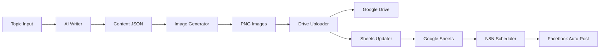

# 🚀 Multi-Brand Content Automation System

> AI-powered content automation platform for managing multiple social media brands with automated posting to Facebook.

[](https://opensource.org/licenses/MIT)
[](https://nodejs.org)
[](https://anthropic.com)

## 📋 Features

- 🤖 **AI Content Generation** - Powered by Claude AI for high-quality content
- 🎨 **Multi-Brand Management** - Support for 3+ brands simultaneously
- 🖼️ **Automated Image Generation** - Create beautiful carousels with Puppeteer
- ☁️ **Google Drive Integration** - Auto-upload and organize content
- 📊 **Google Sheets Sync** - Centralized content management
- 📱 **Facebook Auto-Posting** - Schedule and publish via N8N workflows
- 📈 **Real-Time Dashboard** - Monitor workflows with WebSocket updates
- 🔄 **Complete Automation** - From idea to published post in minutes

## 🎯 Supported Brands

1. **Long Best AI** 🤖 - AI Education (Vietnamese)
2. **Queen Nail Bern** 💅 - Nail Salon (German/Swiss)
3. **Thach Vu Land** 🏘️ - Real Estate (Vietnamese)

## 🏗️ Tech Stack

- **AI**: Anthropic Claude API
- **Image Generation**: Puppeteer (Headless Chrome)
- **Cloud Storage**: Google Drive API
- **Data Management**: Google Sheets API
- **Automation**: N8N Workflows
- **Database**: SQLite
- **Real-Time**: WebSocket
- **Backend**: Node.js

## 📦 Installation

### Prerequisites

- Node.js 18+
- Google Cloud Project with Drive & Sheets APIs enabled
- Anthropic Claude API key
- Facebook Developer Account (for posting)

### Quick Start

```bash
# Clone repository
git clone https://github.com/yourusername/automation.git
cd automation

# Install dependencies
npm install

# Setup environment variables
cp .env.example .env
# Edit .env with your credentials

# Setup Google Cloud credentials
# 1. Download credentials.json from Google Cloud Console
# 2. Place in project root
# 3. Run authentication
npm run auth

# Start dashboard
npm run start:monitor

# Open dashboard
open http://localhost:3002
```

## 🚀 Usage

### Option 1: Dashboard (Recommended)

1. Start the dashboard:
```bash
npm run start:monitor
```

2. Open http://localhost:3002

3. Fill in the form:
   - Select Fanpage
   - Enter Topic
   - Choose Format & Style
   - Click "🚀 Tạo Ngay"

### Option 2: CLI

```bash
# Complete workflow
node scripts/daily-agent.js "Your Topic" --brand longbest-ai

# With options
node scripts/daily-agent.js "AI Tips 2026" \
  --brand longbest-ai \
  --format carousel-standard \
  --style notebook
```

### Option 3: API

```bash
curl -X POST http://localhost:3002/api/create-content \
  -H "Content-Type: application/json" \
  -d '{
    "brand": "longbest-ai",
    "topic": "5 AI Tips",
    "format": "carousel-standard",
    "style": "notebook"
  }'
```

## 📖 Documentation

- [📘 Complete Guide](./PROJECT.md) - Full documentation
- [⚡ Quick Start](./QUICK_START.md) - Get started in 5 minutes
- [💻 Commands Reference](./COMMANDS.md) - All available commands
- [🎨 Design Guides](./brands/) - Brand-specific guidelines

## 🔧 Configuration

### Brand Setup

Each brand has a `brand.json` config file:

```json
{
  "brandId": "longbest-ai",
  "name": "Long Best AI",
  "googleSheets": {
    "sheetId": "your-sheet-id"
  },
  "facebook": {
    "pageId": "your-page-id"
  },
  "designStyle": {
    "primary": "notebook",
    "secondary": "tutorial"
  }
}
```

### Environment Variables

See [.env.example](./.env.example) for all configuration options.

## 🔄 Workflow



## 📊 Dashboard Features

- ✅ **Create New Content** - Simple form interface
- ✅ **Real-Time Monitoring** - WebSocket updates
- ✅ **Workflow Tracking** - See progress step-by-step
- ✅ **Metrics Dashboard** - Success/failure stats
- ✅ **Direct Sheet Access** - Quick links to Google Sheets

## 🌐 Deployment Options

### Option 1: VPS (Recommended for Production)

**Providers**: DigitalOcean, Linode, Vultr, AWS EC2

```bash
# On your VPS
git clone https://github.com/yourusername/automation.git
cd automation
npm install
cp .env.example .env
# Edit .env with production values
npm run start:monitor

# Use PM2 for process management
npm install -g pm2
pm2 start scripts/workflow-monitor/start-all.sh
pm2 save
pm2 startup
```

### Option 2: Railway.app (Easy Deployment)

[](https://railway.app/new/template)

1. Click "Deploy on Railway"
2. Add environment variables
3. Deploy!

### Option 3: Render.com

1. Fork this repository
2. Create new Web Service on Render
3. Connect your repo
4. Add environment variables
5. Deploy

### Option 4: Docker

```bash
# Coming soon - Docker support
```

## 🔐 Security Notes

⚠️ **IMPORTANT**: Never commit these files:
- `credentials.json`
- `token.json`
- `.env`
- Any file with API keys or secrets

All sensitive files are protected by `.gitignore`.

## 📱 N8N Workflows

Import workflows from `n8n-skill/`:

1. `autopost-tvland.json` - Auto-post to Facebook
2. `upload-claude-content.json` - Sync content to Sheets
3. `nano-banana-pro.json` - AI image generation
4. `daily-sketchnote-researcher.json` - Research automation

## 🐛 Troubleshooting

### Dashboard not connecting?

```bash
# Restart servers
pkill -f "workflow-monitor"
./scripts/workflow-monitor/start-all.sh
```

### Google API errors?

```bash
# Re-authenticate
npm run auth
```

### Puppeteer issues?

```bash
# Reinstall Puppeteer with Chromium
npm install puppeteer --force
```

## 🤝 Contributing

Contributions welcome! Please read our [Contributing Guide](./CONTRIBUTING.md) first.

## 📄 License

MIT License - see [LICENSE](./LICENSE) file for details.

## 🙏 Acknowledgments

- [Anthropic Claude](https://anthropic.com) - AI content generation
- [Google Cloud](https://cloud.google.com) - Drive & Sheets APIs
- [Puppeteer](https://pptr.dev/) - Headless browser automation
- [N8N](https://n8n.io/) - Workflow automation

## 📞 Support

- 📖 [Documentation](./PROJECT.md)
- 🐛 [Issue Tracker](https://github.com/yourusername/automation/issues)
- 💬 [Discussions](https://github.com/yourusername/automation/discussions)

## ⭐ Star History

If you find this project helpful, please give it a star!

---

**Made with ❤️ by [Your Name]**

**Last Updated**: 2026-01-19
